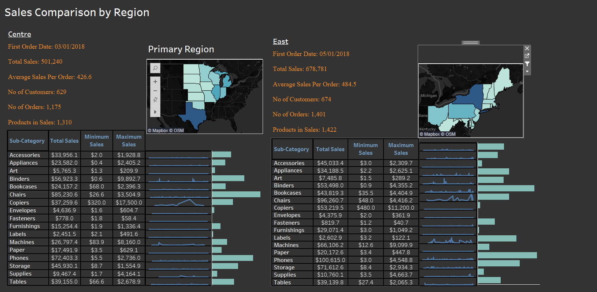

# Tableau Project 

## Comparison of Region Based on Sales

 ## Project Description

 This interactive Tableau dashboard was created to visualize the sales comparison between two selected regions. The key goals were to: 
 - Compare sales performance between two selected regions using interactive visualizations
 - Build a dynamic Tableau dashboard to support data-driven decision making
 - Enable region-wise comparison through user-controlled parameters (Primary & Secondary Region)
 - Analyze key business metrics
 - Implement hierarchies to represent location-based data effectively
 - Use calculated fields to derive meaningful insights from raw sales data
 - Provide management with a clear, visual understanding of regional performance

Key visualizations include:

- Side-by-side comparison of Primary Region and Secondary Region for easy performance analysis
- Filled maps highlighting selected regions to provide geographic context for sales performance
- KPI Summary Cards (First Order Date, Total Sales, Average Sales per Order, Number of Customers, Number of Orders, Number of Products Sold)
- Tabular breakdown of sales by product sub-category for each region
- Mini line charts showing sales trends over time for each sub-category
- Enables quick identification of top- and low-performing product categories
- Symmetrical dashboard layout to ensure consistent and intuitive region-to-region comparison

## About Tableau

Tableau is a powerful data visualization and business intelligence tool. Some key features:

- Drag and drop interface to build interactive dashboards 

- Broad data connectivity to combine data sources 

- Diverse visualization types including maps, charts, graphs etc.

- Smart analytics with trendlines, forecasting, clustering etc.

- Sharing capabilities for visualizations and dashboards

## How to Use

1. Download and install Tableau Desktop
2. Download the .twbx file for any project
3. Open the file in Tableau to interact with the visualizations
4. Connect to your own data sources to create custom dashboards
